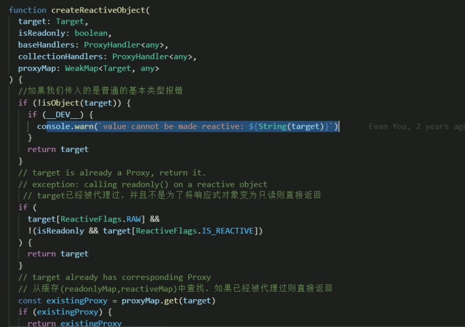

> 版权声明：本文为博主「小满 zs」原创文章，遵循 CC 4.0 BY-SA 版权协议，转载请附上原文出处链接和本声明。
> 原文地址 [blog.csdn.net](https://blog.csdn.net/qq1195566313/article/details/122784094)

# `reactive`

**用来绑定复杂的数据类型 例如 对象 数组**

reactive [源码](https://so.csdn.net/so/search?q=%E6%BA%90%E7%A0%81&spm=1001.2101.3001.7020) 约束了我们的类型



`他是不可以绑定普通的基本数据类型`这样是不允许 会给我们报错

```js
import { reactive} from 'vue'
 
let person = reactive('sad')
```
抛出错误 `err: value cannot be made reactive: $msg`

绑定普通的数据类型 我们可以 使用昨天讲到 ref

你如果用 ref 去绑定对象 或者 [数组](https://so.csdn.net/so/search?q=%E6%95%B0%E7%BB%84&spm=1001.2101.3001.7020) 等复杂的数据类型 我们看源码里面其实也是 去调用 reactive

使用 reactive 去修改值无须。value

## reactive 基础用法

```js
import { reactive } from 'vue'
let person = reactive({
   name:"小满"
})
// 对象进行赋值
person.name = "大满"
```

### 数组异步赋值问题

这样赋值页面是不会变化的因为会脱离响应式

```js
let person = reactive<number[]>([])
setTimeout(() => {
  person = [1, 2, 3]

  console.log(person);
  
},1000)
```

proxy 可以劫持到对象所有属性的变化，但是对于这种直接赋值过去，没有改变对象的属性，所以劫持不到也就没有响应式

- 解决方案 1

  使用 push

  ```js
  import { reactive } from 'vue'
  let person = reactive<number[]>([])
  setTimeout(() => {
    const arr = [1, 2, 3]
    person.push(...arr)
    console.log(person);
    
  },1000)
  ```

- 方案 2

  包裹一层对象

  ```js
  type Person = {
    list?:Array<number>
  }
  let person = reactive<Person>({
    list:[]
  })
  setTimeout(() => {
    const arr = [1, 2, 3]
    person.list = arr;
    console.log(person);
    
  },1000)
  ```

## readonly

拷贝一份 proxy 对象将其设置为只读

```js
import { reactive ,readonly} from 'vue'
const person = reactive({count:1})
const copy = readonly(person)
 
 //person.count++
 
 copy.count++
```

## shallowReactive 

只能对浅层的数据 如果是深层的数据只会改变值 不会改变视图

案例

```vue
<template>
  <div>
    <div>{{ state }}</div>
    <button @click="change1">test1</button>
    <button @click="change2">test2</button>
  </div>
</template>
 
<script setup lang="ts">
import { shallowReactive } from 'vue'
 
const obj = {
  a: 1,
  first: {
    b: 2,
    second: {
      c: 3
    }
  }
}
 
const state = shallowReactive(obj)
 
function change1() {
  state.a = 7
}
function change2() {
  state.first.b = 8
  state.first.second.c = 9
  console.log(state);
}
 
</script> 
```