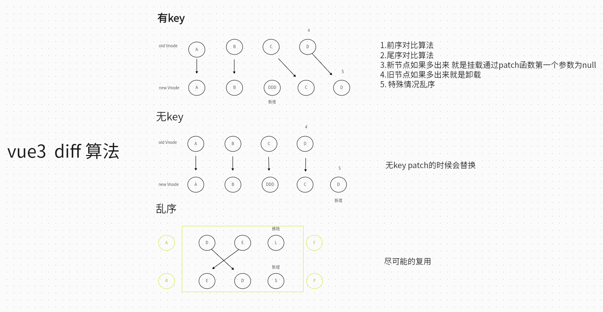

> 版权声明：本文为博主「小满 zs」原创文章，遵循 CC 4.0 BY-SA 版权协议，转载请附上原文出处链接和本声明。
> 原文地址 [blog.csdn.net](https://blog.csdn.net/qq1195566313/article/details/122778560)

## 虚拟 DOM

虚拟 DOM 就是通过 JS 来生成一个 AST 节点树
发现一个 dom 上面的属性是非常多的

所以直接操作 DOM 非常浪费性能

解决方案就是 我们可以用 JS 的计算性能来换取操作 DOM 所消耗的性能，既然我们逃不掉操作 DOM 这道坎，但是我们可以尽可能少的操作 DOM

操作 JS 是非常快的

## 介绍 Diff 算法

Vue3 源码地址 https://github.com/vuejs/core

针对 DOM 操作进行优化，因为 DOM 的大多数操作为 增加和删除，同时利用`:key` 值进行比较
1. 前序对比算法
2. 尾序对比算法
3. 新节点如果多出来就是挂载通过 patch 函数第一个参数为 null
4. 旧节点如果多出来就是卸载
5. 特殊情况乱序

如果是最普遍的比较两个数组的差异需要 O(n^2) ，这种算法大大降低了所需的时间复杂度

详细解说可以观看视频讲解 小满 zs 的个人空间_哔哩哔哩_Bilibili
